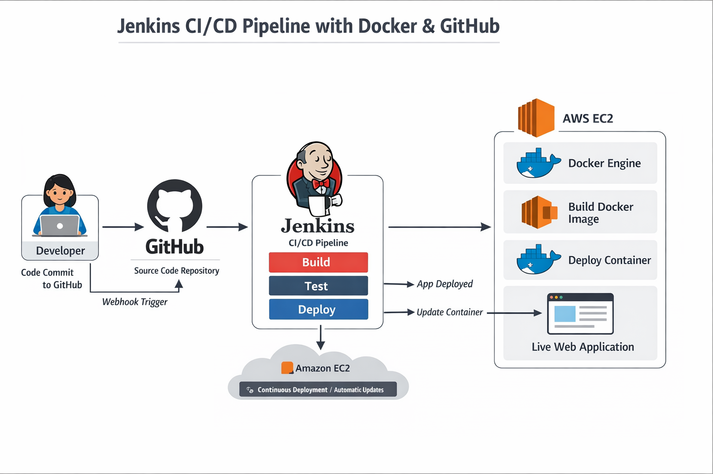

# Jenkins CI/CD Pipeline with Docker and GitHub

This repository demonstrates a Jenkins pipeline implementation for achieving **Continuous Integration and Continuous Deployment (CI/CD)** using **Docker** and **GitHub**.

---

## Introduction

The CI/CD pipeline provided in this project automates the process of **building, testing, and deploying applications** whenever changes are pushed to the GitHub repository.

**Jenkins** is used as the automation server to orchestrate the pipeline, while **Docker** is used to containerize and deploy the application. This setup reflects a real-world DevOps workflow commonly used in production environments.

---

## Prerequisites

Before setting up the pipeline, ensure that you have the following:

1. An **Amazon EC2 Linux instance**
2. Jenkins installed and running
3. Docker installed and running
4. Git installed
5. A GitHub repository containing:
   - Application source code
   - Dockerfile

---

## Project Pipeline Flowchart

The CI/CD pipeline workflow is illustrated below:




---

## Installation Instructions

### Installing Jenkins

1. Update system packages:
```bash
sudo yum update -y

2. Add the Jenkins repository:

   sudo wget -O /etc/yum.repos.d/jenkins.repo \
   https://pkg.jenkins.io/redhat-stable/jenkins.repo


3. Import Jenkins GPG key:

   sudo rpm --import https://pkg.jenkins.io/redhat-stable/jenkins.io-2023.key

4. Install Java
    Amazon Linux 2
    sudo amazon-linux-extras install java-openjdk11 -y

    Amazon Linux 2023
    sudo dnf install java-11-amazon-corretto -y


5. Install Jenkins:
   sudo yum install jenkins -y


6. Enable and start Jenkins:
   sudo systemctl enable jenkins
   sudo systemctl start jenkins


7. Check Jenkins status:

   sudo systemctl status jenkins

### Installing Docker

1. Install Docker:
   sudo yum install docker -y


2. Enable and start Docker:
   sudo systemctl enable docker
   sudo systemctl start docker

### Installing Git
    sudo yum install git -y

### Additional Configuration

1. To allow Jenkins to run Docker commands:
   sudo usermod -aG docker jenkins


2. Restart Jenkins:
   sudo systemctl restart jenkins

### Pipeline Overview

The Jenkins pipeline is triggered using a GitHub Webhook whenever code is pushed to the repository.

Pipeline Steps:

1. Jenkins checks for an existing running Docker container.

2. If a container is running:

   Updated files are copied from the Jenkins workspace into the container.

3. If no container is running:

   A new Docker image is built.

   A new container is launched using the built image.

4. The application becomes accessible through the configured port on the EC2 instance.

### Getting Started

1. Set up Jenkins, Docker, and Git on the EC2 instance.

2. Generate a GitHub Personal Access Token with repo and webhook permissions.

3. In Jenkins:

   Go to Manage Jenkins → Manage Credentials

   Add your GitHub token as a Secret Text

4. Create a Freestyle Jenkins Job.

5. Configure:

   GitHub repository URL

   Enable GitHub hook trigger for GITScm polling

6. Add an Execute Shell build step:

   #!/bin/bash

   container_id=$(docker ps --filter "status=running" --format "{{.ID}}")

   if [ -n "$container_id" ]; then
     docker cp $WORKSPACE/. "$container_id":/usr/share/nginx/html
   else
     docker build -t webapp-image $WORKSPACE
     docker run -d -p 9090:80 webapp-image
   fi


7. Run the Jenkins job and verify deployment.
Updated 
